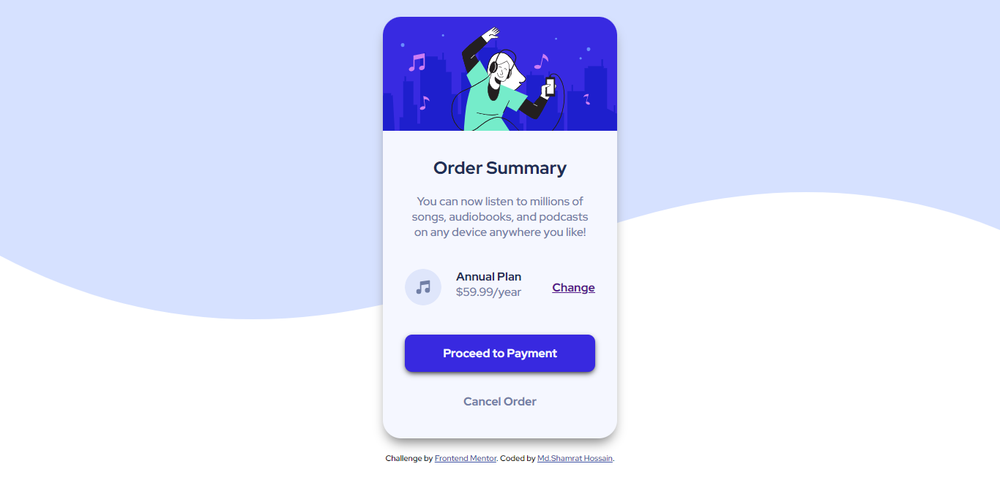

# Order summary card 

This is a solution to the [Order summary card challenge on Frontend Mentor]

## Table of contents

- [Overview](#overview)
  - [Screenshot](#screenshot)
  - [Links](#links)
- [My process](#my-process)
  - [Built with](#built-with)
- [Author](#author)

## Overview

This Order Summery component was a simple fun project. I used CSS variables, flexbox and some common CSS properties.

### Screenshot

### Links

- Solution URL: [Add solution URL here](https://github.com/shamratPG/order-summary)
- Live Site URL: [Add live site URL here](https://shamratpg.github.io/order-summary/)

### Built with

- Semantic HTML5 markup
- CSS custom properties
- Flexbox
- CSS Grid
- Mobile-first workflow
<!-- - [React](https://reactjs.org/) - JS library
- [Next.js](https://nextjs.org/) - React framework
- [Styled Components](https://styled-components.com/) - For styles -->

## Author

- Website - [Md. Shamrat Hossain](https://github.com/shamratPG)
- Twitter - [@shamratpg](https://twitter.com/shamratpg)
- Frontend Mentor - [@shamratPG](https://www.frontendmentor.io/profile/shamratPG)
